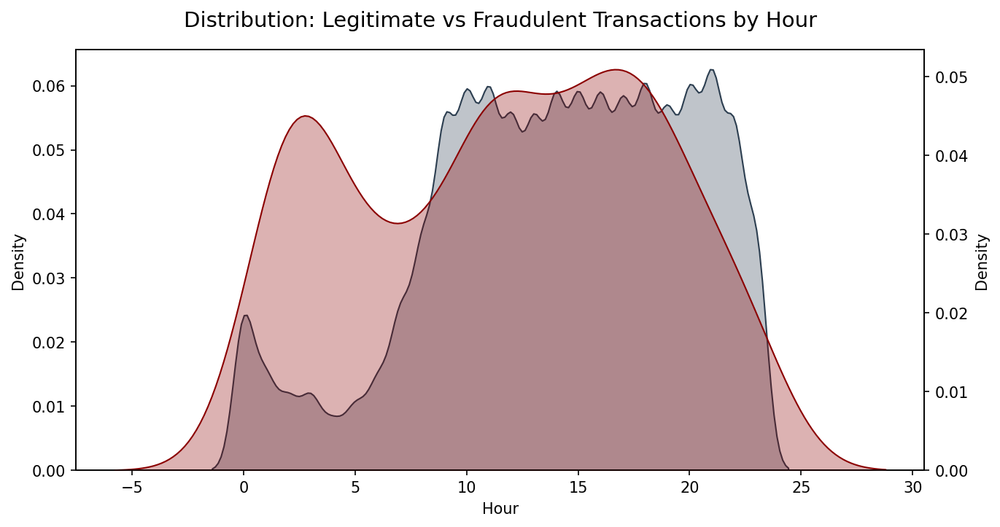

# Analyst's Methodology: Step 1 (Time Analysis)

As a Data Analyst, programming code is merely a tool. True value lies in the **thought process** and decision-making when facing raw data. This document outlines the step-by-step logic behind the code in Step 1.

---


## 0. The Analyst's Thought Process (Flowchart)
Here is the blueprint of my analytical methodology.



## 1. Why Start with Time?
> *"Criminals operate beyond the bounds of normality."*

When confronted with a dataset of 284,807 rows, a beginner's instinct is to immediately look for complex feature correlations. However, logically, a banking security system's biggest vulnerability is the **absence of human oversight (the victim)**. 

If a fraudster steals in broad daylight, the victim will immediately receive an SMS notification and block the card. Therefore, my initial hypothesis was: *Fraud must exhibit a different temporal pattern compared to normal transactions.*

---

## 2. Feature Engineering Decision
The dataset provides the `Time` column in the format of "seconds elapsed since the first transaction". This data is unreadable to the business. Bank directors do not care about "second 86,400", they care about "What time?". 

Therefore, I decided to engineer a new feature to extract the **Hour**.

```python
# Transform Seconds to 24-Hour Format
import pandas as pd
df = pd.read_csv('creditcard.csv')

# Logic: 3600 seconds = 1 hour. Modulo (%) 24 is used to reset the 25th hour back to 1.
df['Hour'] = (df['Time'] / 3600).astype(int) % 24
```

---

## 3. Visualization Challenge: Imbalanced Data
> *"How do you compare an ant and an elephant in the same cage?"*

The biggest challenge in Fraud detection is *Imbalanced Data*. There are **284,315** normal transactions, but only **492** (0.17%) fraudulent ones. If I used a standard plotting code, the fraud line would be a flat line at zero, completely invisible.

Therefore, I made the technical decision to **separate the Y-Axis (Dual-Axis)**. By doing this, even the smallest fluctuations in the fraudster's movements become proportionally visible.

### Visual Evidence: The Midnight Spike


---

## 4. Final Result & Business Recommendation
The methodology above yielded more than just a chart; it birthed a **Strong Business Recommendation**:

Based on the chart, normal transaction activity drops sharply from midnight to 6:00 AM. However, fraudulent activity **does not experience a proportional drop** during the early hours. Cybercriminals are active when customers are asleep.

**Recommendation (The Night-Watch Protocol):**
Increase system sensitivity between 01:00 - 06:00 AM. Any high-value transaction during these hours must trigger **Step-Up Authentication** (requesting OTP verification via SMS) before funds are released.
