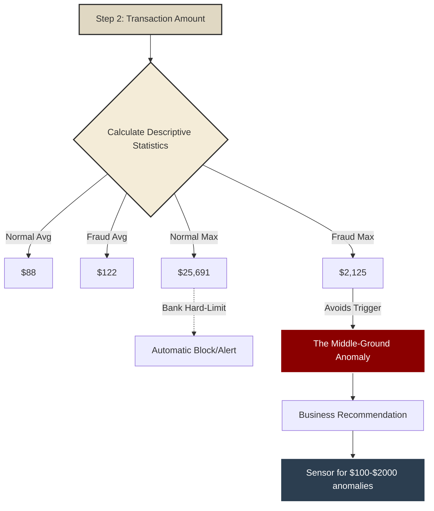

# Analyst's Methodology: Step 2 (Amount Analysis)

## 0. The Analyst's Thought Process (Flowchart)
Here is the blueprint of my analytical methodology for Step 2.

*(Alternatively, view the native `Methodology_Flowchart_Step2.svg` image provided in this folder).*

---

## 1. The Core Question
After analyzing *when* they strike, the next logical question is *how much* they steal. Do they rob the bank of millions in one go, or do they siphon pennies slowly?

---

## 2. Uncovering the "Middle-Ground" Anomaly
I utilized descriptive statistics and logarithmic Boxplots to compare legitimate vs fraudulent amounts.
The numbers revealed a genius, yet sinister, strategy:
- The **average** fraud is **$122** (higher than the normal average of $88).
- However, the **maximum** fraud is **$2,125**, completely dwarfed by the normal maximum of **$25,691**.

Fraudsters intentionally cap their transactions. They know stealing $10,000 in one swipe triggers an automatic hard-limit alert. Therefore, they operate in the "Middle-Ground" ($100 - $2000).

### Visual Evidence

---

## 3. Business Recommendation
We must calibrate the AI not just to flag extremely large transactions, but to be hypersensitive to medium-sized transactions ($100-$2000) that occur during the Night-Watch hours (01:00-06:00 AM).
