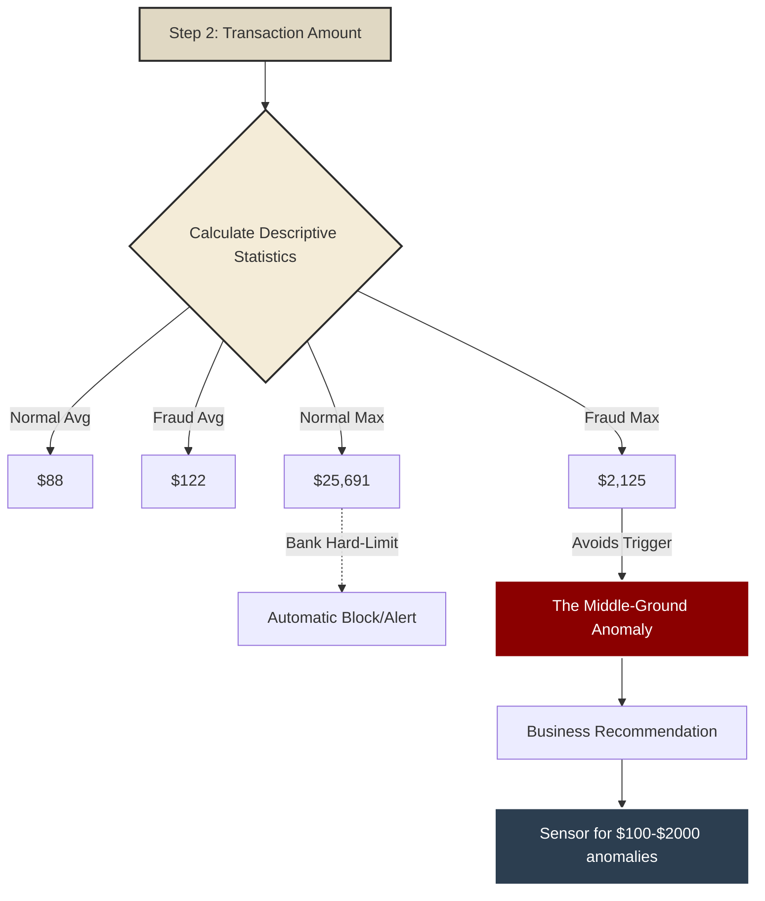
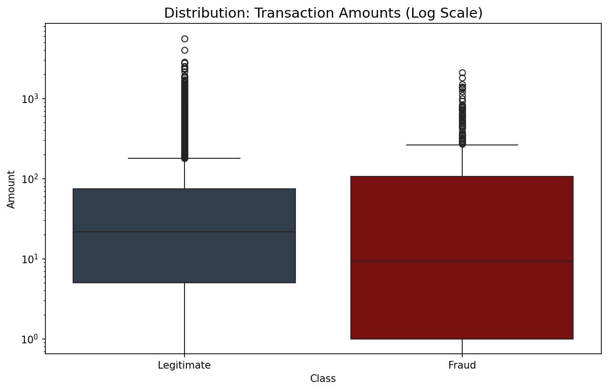

# Metodologi Analis: Step 2 (Analisis Nominal)

## 0. Alur Pemikiran Analis (Flowchart)
Berikut adalah cetak biru metodologi analitik saya untuk Step 2.

*(Sebagai alternatif, Anda bisa melihat gambar `Methodology_Flowchart_Step2.svg` di dalam folder ini).*

---

## 1. Pertanyaan Inti
Setelah menganalisis *kapan* penjahat beraksi, pertanyaan selanjutnya adalah *berapa banyak* uang yang mereka curi? Apakah mereka menguras ratusan juta sekaligus, atau mencuri ribuan rupiah secara perlahan?

---

## 2. Mengungkap Anomali "Zona Menengah"
Saya menggunakan statistik deskriptif dan Boxplot logaritmik untuk membongkarnya. Hasilnya mengungkap taktik yang sangat cerdas:
- **Rata-rata** penipuan adalah **$122** (lebih tinggi dari rata-rata normal $88).
- Namun, **Maksimal** penipuan berhenti di angka **$2.125**, kalah jauh dari nilai maksimal transaksi normal yang bisa mencapai **$25.691**.

Penipu sengaja membatasi nominal transaksi. Mereka tahu bahwa mencuri $10.000 sekaligus akan memicu sistem blokir otomatis. Karena itu, mereka bermain aman di "Zona Menengah" ($100 - $2000).

### Bukti Visual

---

## 3. Rekomendasi Bisnis
Sistem AI Bank tidak boleh hanya di-set untuk memblokir transaksi bernilai raksasa. Sistem harus sangat sensitif terhadap transaksi bernilai menengah ($100-$2000) yang terjadi pada jam tidur nasabah (01:00-06:00 pagi).
