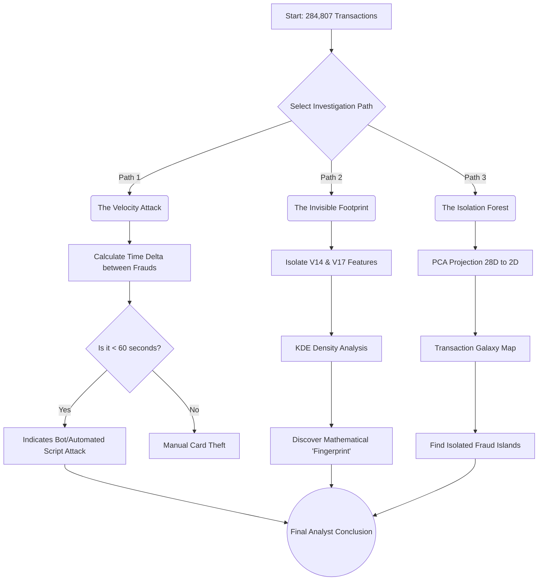

# Step 3: Advanced Forensic Investigation - Uncovering the Fraudster's Blueprint

## 1. Executive Summary
In this final stage of data exploration, we combine three angles of digital forensics to understand exactly **how** fraudsters operate within this credit card dataset. Instead of relying on a single metric, we dissect their attack velocity, mathematical fingerprints, and dimensional mapping.

---

## 2. Forensic Investigation Methodology

---

## 3. Three-Dimensional Investigation Results

### Dimension 1: Attack Velocity
By calculating the *Time Delta* between fraudulent transactions, we found that many fraud cases occur in extremely tight intervals (less than 60 seconds apart). This proves that the fraud syndicate is not manually typing card numbers, but deploying automated bots/scripts to bombard the system.
**Recommendation:** Implement a *Velocity Lock* in banking rules to automatically freeze a card if >3 attempts occur within seconds.

### Dimension 2: Digital Footprint
Although the bank conceals the true identity of the data behind labels `V1` through `V28`, using *Kernel Density Estimation* we observed that `V14` and `V17` have completely opposing distribution shapes (mountains) between legitimate users and fraudsters. These features are the strongest "Fingerprints".

### Dimension 3: Isolation Map
By compressing all 28 features using *Principal Component Analysis (PCA)*, we mapped the transactions into a 2-Dimensional galaxy. The result is striking: The red fraud transactions do not blend with the ocean of blue transactions. They are isolated, forming distinct "islands" in the corner of the dimension. This assures us that the upcoming *Machine Learning* model will easily distinguish them!
