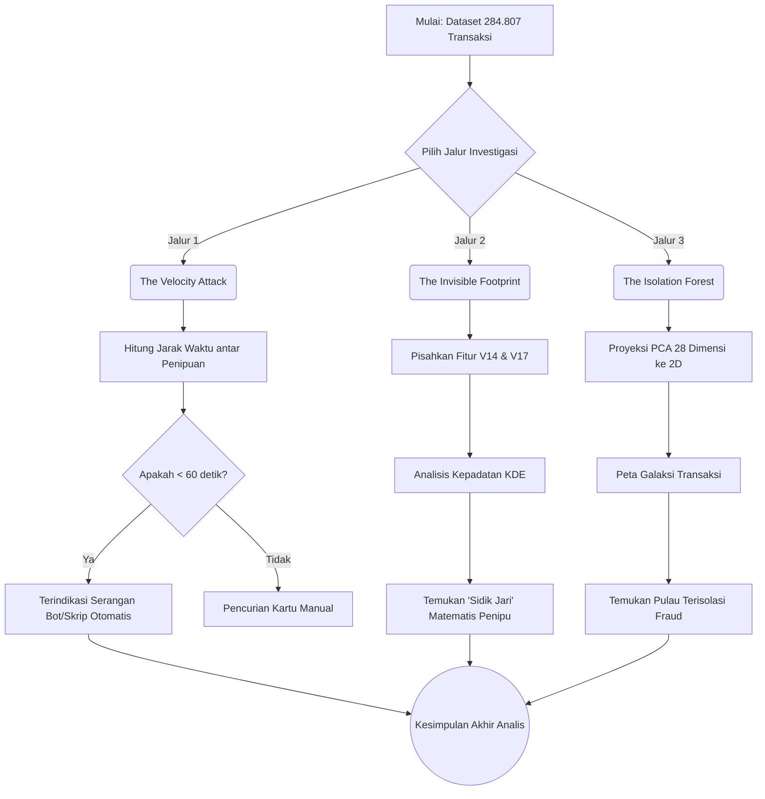

# Step 3: Advanced Forensic Investigation - Uncovering the Fraudster's Blueprint

## 1. Executive Summary
Pada tahap akhir eksplorasi data ini, kita menggabungkan tiga sudut pandang forensik digital untuk memahami secara pasti **bagaimana** penipu beroperasi di dalam dataset kartu kredit ini. Alih-alih hanya mengandalkan satu metrik, kita membedah kecepatan serangan, sidik jari matematis, dan peta dimensional mereka.

---

## 2. Metodologi Investigasi Forensik

---

## 3. Hasil Investigasi 3 Dimensi

### Dimensi 1: Kecepatan Serangan (*Velocity*)
Dari hasil perhitungan *Time Delta* antar transaksi penipuan, kita menemukan bahwa banyak transaksi penipuan terjadi dalam interval yang sangat sempit (kurang dari 60 detik dari penipuan sebelumnya). Ini membuktikan bahwa komplotan penipu tidak mengetik nomor kartu secara manual, melainkan menggunakan *bot/script* yang membombardir sistem secara otomatis.
**Rekomendasi:** Terapkan fitur *Velocity Lock* (Kunci Kecepatan) pada aturan perbankan untuk memblokir kartu secara sepihak jika terjadi >3 percobaan gesek dalam hitungan detik.

### Dimensi 2: Sidik Jari Digital (*Footprint*)
Meskipun bank menyembunyikan identitas asli data di balik label `V1` hingga `V28`, dengan teknik *Kernel Density Estimation* kita dapat melihat bahwa `V14` dan `V17` memiliki bentuk distribusi (gunung) yang sepenuhnya berlawanan antara pengguna sah dan penipu. Fitur inilah yang menjadi "Sidik Jari" terkuat.

### Dimensi 3: Hutan Isolasi (*Isolation Map*)
Dengan memadatkan ke-28 fitur menggunakan *Principal Component Analysis (PCA)*, kita memetakan transaksi ke dalam galaksi 2 Dimensi. Hasilnya sangat jelas: Transaksi penipuan merah tidak membaur dengan lautan transaksi biru. Mereka terisolasi membentuk "kepulauan" tersendiri di sudut dimensi. Ini meyakinkan kita bahwa model *Machine Learning* nanti akan sangat mudah membedakan mereka!
